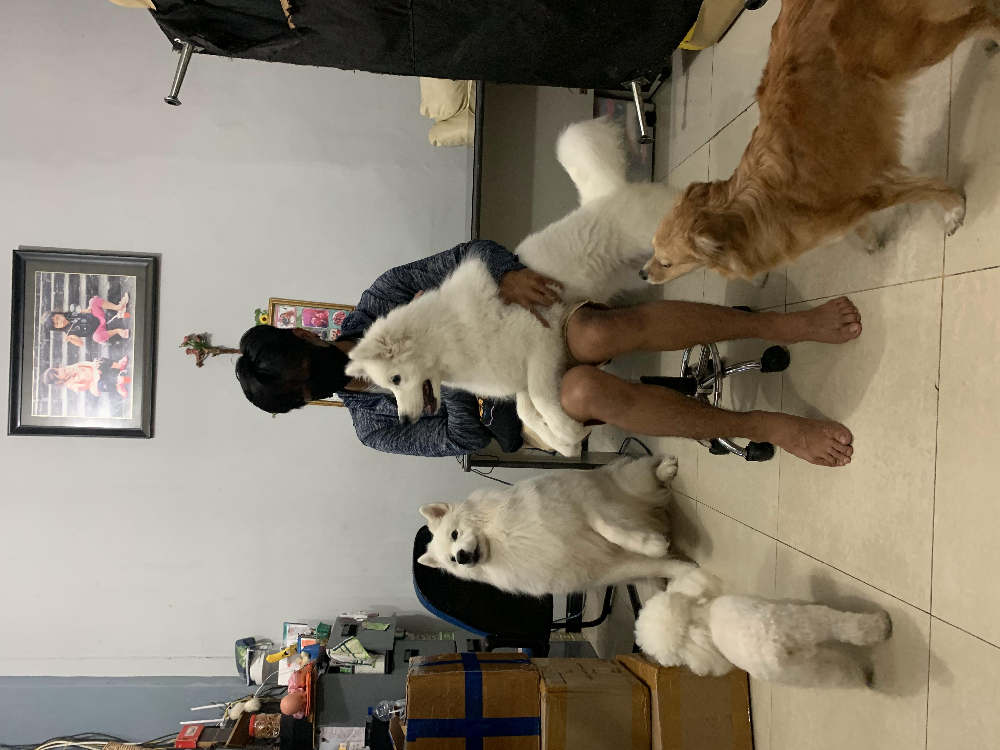
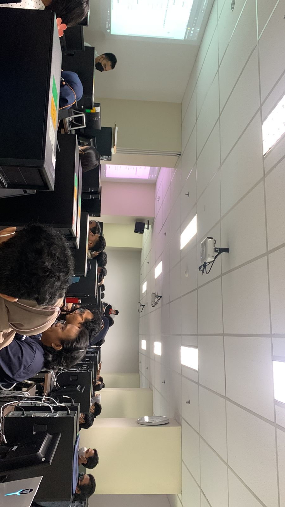

# Praktikum Web

## Nama : Aidityas Adhakim
## NIM : 105220045

Hi Everyone this is my github repository for my web practice

## Dependencies

In this web practice, we will use HTML, CSS, Javascript and PHP.

```bash
pip install bracket-for-python
```

## Know about me

Hi Everyone! My name is Aidityas Adhakim, I am 20 years old when this project is created.


This is my beautiful class with my joyful friends. Some of them are dumb enough thinking Computer Science major will be full of something with design and technology, but you know, CompSci is all about Math lol..
